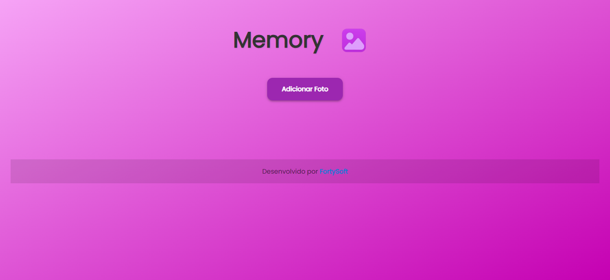

# 📸 Memory — Galeria Online Interativa

---

## 🚧 Status do Projeto

⚠️ Este projeto ainda não está 100% pronto.
Atualmente, ele está em desenvolvimento e novas funcionalidades estão sendo implementadas.

---

## 🎯 Objetivo

O Memory é um projeto feito em React com o intuito de ser uma galeria de fotos online interativa.
A ideia é que, durante festas ou eventos, as pessoas possam:

📲 Acessar o site por meio de um QR Code

📤 Adicionar fotos diretamente na plataforma

👥 Compartilhar lembranças de forma descontraída

💾 Possibilitar salvar todas as fotos depois

💰 Criar oportunidades para monetização (como vender as fotos do evento)

---

## 🚀 Possibilidades Futuras

🖼️ Organização das fotos em álbuns

🔒 Controle de acesso com códigos ou convites

❤️ Reações e comentários nas fotos

📦 Download em lote das imagens

💡 Modelos de uso para eventos, casamentos, festas e empresas

---

## 🛠️ Tecnologias Utilizadas

React.js

CSS3 (customizado com gradiente e botões estilizados)

---

## 📬 Contato

- [📸 Instagram](https://www.instagram.com/_patrick.edueu_)
- [💼 LinkedIn](https://www.linkedin.com/in/patrick-souza-b20b50248/)

  ---
